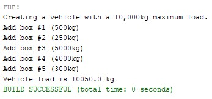
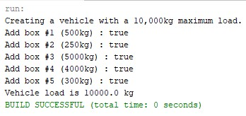
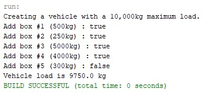

# Java Vehicle Load Management

A progressive Java project that demonstrates the evolution of a vehicle load management program through three different implementations.

The project is organized into three packages, `version1`, `version2`, and `version3`. Each version introduces changes to the `Vehicle` class and its load management behavior, allowing the development of the program to be observed step by step.

## Description

The project starts with a basic implementation where the vehicle load is manipulated directly through its public attributes.

The second version introduces an `addBox()` method to encapsulate the operation of adding a box to the vehicle.

The third version improves the implementation by validating whether the additional load exceeds the vehicle's maximum capacity. It also introduces conversions between kilograms and Newtons.

The three versions are preserved in the same project to demonstrate the progressive development of the solution.

## Features

* Three progressive implementations of the same problem.
* Object-oriented programming with Java classes.
* Encapsulation through methods.
* Vehicle maximum load management.
* Box load management.
* Boolean validation when adding a box.
* Kilograms-to-Newtons conversion.
* Newtons-to-kilograms conversion.
* Separate packages for each version.
* Console-based execution.

## Technologies

* Java
* Object-Oriented Programming
* Classes and Objects
* Methods
* Packages
* Conditional Statements
* Primitive Data Types
* Console Input/Output

## Project Evolution

The project is divided into three versions.

```text
Version 1
   │
   ▼
Direct load manipulation
   │
   ▼
Version 2
   │
   ▼
addBox() method introduced
   │
   ▼
Version 3
   │
   ▼
Maximum load validation
and unit conversion
```

## Version 1

The first version implements a basic `Vehicle` class with two main attributes:

```java
public double load;
public double maxLoad;
```

The constructor receives the maximum vehicle load:

```java
public Vehicle(double kilos)
```

The program then directly modifies the `load` attribute when adding each box.

For example:

```java
vehicle.load = vehicle.load + 500.0;
```

The first version therefore demonstrates direct manipulation of the object's attributes.

### Version 1 Structure

```text
version1/
├── TestVehicle.java
└── Vehicle.java
```

### Version 1 Output



## Version 2

The second version introduces an `addBox()` method:

```java
public boolean addBox(double extraLoad)
```

The test program uses this method instead of directly modifying the `load` attribute:

```java
vehicle.addBox(500.0)
```

This version demonstrates a transition from direct attribute manipulation toward using class methods to perform operations on the object.

The method returns a boolean value indicating whether the operation was accepted by the implementation.

### Version 2 Structure

```text
version2/
├── TestVehicle.java
└── Vehicle.java
```

### Version 2 Output



## Version 3

The third version introduces the most complete implementation of the three versions.

The constructor converts the maximum load from kilograms to Newtons:

```java
this.maxLoad = KilosToNewtons(maxLoad);
```

The `addBox()` method validates whether the new load remains within the maximum capacity:

```java
if (load + KilosToNewtons(extraLoad) <= maxLoad)
```

If the vehicle can accept the additional load, the value is added and the method returns `true`.

Otherwise, the method returns `false`.

```java
else {
    return false;
}
```

### Unit Conversion

Version 3 introduces two private methods for unit conversion.

Kilograms to Newtons:

```java
private double KilosToNewtons(double kilos)
```

Newtons to kilograms:

```java
private double NewtonsToKilos(double newtons)
```

The conversion uses the gravitational acceleration value:

```text
9.81 m/s²
```

The project therefore internally manages the vehicle's load in Newtons while exposing the load through kilograms.

### Version 3 Structure

```text
version3/
├── TestVehicle.java
└── Vehicle.java
```

### Version 3 Output



## Comparison Between Versions

| Version   | Main Implementation                          |
| --------- | -------------------------------------------- |
| Version 1 | Direct manipulation of the vehicle load      |
| Version 2 | Introduces the `addBox()` method             |
| Version 3 | Adds capacity validation and unit conversion |

## Main Classes

Each version contains two classes.

### `TestVehicle`

The `TestVehicle` class contains the `main` method used to create a vehicle and test the load operations.

The same general test scenario is maintained throughout the three versions:

```text
Maximum load: 10,000 kg

Box #1: 500 kg
Box #2: 250 kg
Box #3: 5,000 kg
Box #4: 4,000 kg
Box #5: 300 kg
```

### `Vehicle`

The `Vehicle` class represents the vehicle and contains the attributes and methods required to manage its load.

The implementation changes between versions as the project evolves.

## Version 1 Class

The first version contains:

```text
Vehicle
├── load
├── maxLoad
├── Vehicle()
├── getLoad()
└── getMaxLoad()
```

The load is modified directly from `TestVehicle`.

## Version 2 Class

The second version adds:

```text
Vehicle
├── load
├── maxLoad
├── addBox
├── Vehicle()
├── getLoad()
├── getMaxLoad()
└── addBox()
```

The test program now calls `addBox()` when adding each box.

## Version 3 Class

The third version adds load validation and unit conversion:

```text
Vehicle
├── load
├── maxLoad
├── Vehicle()
├── getLoad()
├── getMaxLoad()
├── addBox()
├── KilosToNewtons()
└── NewtonsToKilos()
```

The conversion methods are private because they are internal implementation details of the class.

## Example Test

All three versions use a vehicle with a maximum capacity of:

```text
10,000 kg
```

The test then attempts to add several boxes:

```text
Box #1 → 500 kg
Box #2 → 250 kg
Box #3 → 5,000 kg
Box #4 → 4,000 kg
Box #5 → 300 kg
```

The total requested load is:

```text
500 + 250 + 5000 + 4000 + 300 = 10,050 kg
```

Therefore, in Version 3, the final 300 kg box exceeds the vehicle's 10,000 kg maximum capacity and should be rejected by `addBox()`.

## Concepts Demonstrated

This project demonstrates several fundamental object-oriented programming concepts:

* Classes.
* Objects.
* Constructors.
* Attributes.
* Methods.
* Access modifiers.
* Public methods.
* Private methods.
* Boolean return values.
* Conditional statements.
* Packages.
* Progressive implementation.
* Unit conversion.
* Object state management.

## Package Organization

The three implementations are intentionally separated into packages:

```text
src/
├── version1/
├── version2/
└── version3/
```

This allows the three implementations to coexist in the same Java project without class-name conflicts, since each version contains classes with the same names:

```text
version1.Vehicle
version2.Vehicle
version3.Vehicle
```

and:

```text
version1.TestVehicle
version2.TestVehicle
version3.TestVehicle
```

## Execution

Each version can be executed independently through its corresponding `TestVehicle` class.

### Version 1

Run:

```text
version1.TestVehicle
```

### Version 2

Run:

```text
version2.TestVehicle
```

### Version 3

Run:

```text
version3.TestVehicle
```

The three versions can therefore be compared using the same basic test scenario.

## Limitations

The three versions represent different stages of the implementation and are intentionally preserved as separate versions.

Version 1 directly manipulates the vehicle's load.

Version 2 introduces the `addBox()` method but does not yet implement the maximum-load validation logic.

Version 3 introduces the capacity validation and unit conversion mechanisms.

The project is primarily intended to demonstrate the evolution of an object-oriented implementation rather than provide a production-ready vehicle load management system.

## Project Structure

```text
Java-Vehicle-Load-Management/
│
├── src/
│   ├── version1/
│   │   ├── TestVehicle.java
│   │   └── Vehicle.java
│   │
│   ├── version2/
│   │   ├── TestVehicle.java
│   │   └── Vehicle.java
│   │
│   └── version3/
│       ├── TestVehicle.java
│       └── Vehicle.java
│
├── assets/
│   └── images/
│       ├── version1_output.jpg
│       ├── version2_output.jpg
│       └── version3_output.jpg
│
├── README.md
├── LICENSE
└── .gitignore
```

## License

This project is distributed under the MIT License.

See the `LICENSE` file for more information.

## Author

**Luis Alva**

Java project focused on object-oriented programming, progressive implementation, and fundamental software design concepts.
